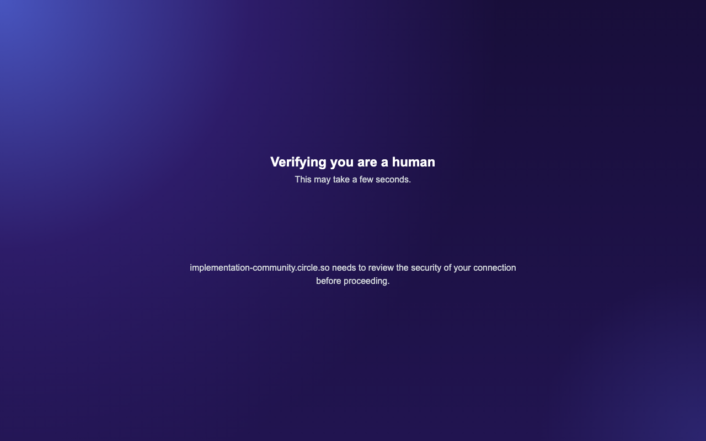

# PoC: can a server-hosted browser hold a Circle session?

**Verdict: `BLOCKED_BY_CHALLENGE`. The `Railway → persistent Chromium → Circle`
architecture is not viable.** Circle serves a Cloudflare "Verifying you are a
human" interstitial to an automated browser. Getting past that would mean
defeating an access control, so the PoC stops there by design.

Run date: 2026-09-07. Code: `circle_leads/remote_browser/`.

---

## What was proposed

Put the browser on the server instead of on your Mac, so the Circle session
*originates* on Railway and no cookie is ever exported and replayed:

```
                    RAILWAY
┌─────────────────────────────────────┐
│ Chromium + persistent profile       │
│          ↓                          │
│       Circle.so                     │
│          ↑                          │
│    YOU log in via the dashboard     │
└─────────────────────────────────────┘
```

This is a genuinely different (and better) proposition than exporting cookies
from a laptop and replaying them from a datacenter, which remains out of scope
and is not implemented.

## What was built

| Piece | Where |
| --- | --- |
| Persistent server-side Chromium, one profile, thread-serialized | `remote_browser/session.py` |
| Challenge detector (pure function, unit-tested) | `session.detect_challenge` |
| The 8-step probe | `remote_browser/probe.py` |
| Authenticated routes + live view / input relay | `web/remote_browser_api.py` |
| Dashboard tab: live view, click/type relay, PoC runner | `web/static/index.html` |

The live view is a screenshot poll plus a click/keystroke relay, so you drive
Circle's own login page inside the server browser. Typed text is passed
straight to the browser: never logged, never stored, never persisted.

## Results

| # | Step | Result |
| --- | --- | --- |
| 1 | Chromium starts on the server | ✅ launches, persistent profile |
| 2 | Secure interactive view | ✅ authenticated screenshot + input relay |
| 3 | Navigate to Circle | ❌ **redirected to a Cloudflare challenge** |
| 4 | Log in manually | ⛔ not reachable — blocked at step 3 |
| 5 | Session persists afterwards | ⛔ not reachable |
| 6 | Read an enrolled private community | ⛔ not reachable |
| 7 | Does Circle challenge automation? | ✅ **measured: yes, consistently** |
| 8 | Report before integrating | ✅ this document |

### The measurement that settles it

Navigating to a community redirects to a Cloudflare interstitial:

```
https://implementation-community.circle.so/?__cf_chl_rt_tk=qFv6EKkgmILZ…
```



Reproduced on **4 of 4** communities tried: `implementation-community`,
`30mpc`, `360neurogo`, `6-lane-highway-academy`.

**The decisive detail:** this was run from a **residential IP on a MacBook**, not
from a datacenter. So the trigger is *browser automation*, not Railway's IP
range. Moving it to Railway can only make this worse — datacenter ASNs score
worse with Cloudflare, not better.

For contrast, a plain `curl` with a normal desktop user-agent gets **HTTP 403**
from the same hosts. Circle blocks non-interactive clients at the edge.

## Why this stops here

You said it directly:

> if it presents a challenge, the system should stop rather than attempt to
> defeat it.

Circle presents a challenge. Everything that would get past it — a stealth
plugin, a patched fingerprint, a spoofed user-agent, a residential proxy, a
CAPTCHA-solving service — is circumvention of an access control. None of it is
implemented, and the detector is deliberately broad: a false positive stops us
(safe), a false negative would leave us hammering a challenge page (not safe).

## What still works

The **local connector** (`docs/connector.md`). You log into Circle yourself, in
a real browser you are already using, on your own machine. No automated
navigation triggers the interstitial, because the session is established by you
interacting with Circle normally. Railway stays the control plane; only the
browser is local.

This is also the only route available at all, because Circle has no member API:
no OAuth, no member personal-access token, and no "list my communities"
endpoint — verified against the live OpenAPI specs, not just the prose docs.
See `docs/circle_auth_investigation.md`.

## Reproducing it

The remote browser is **opt-in and off by default**:

```bash
REMOTE_BROWSER_ENABLED=true            # required; otherwise every route 503s
REMOTE_BROWSER_PROFILE=/data/profile   # a mounted volume, to survive redeploys
```

The image also needs Chromium (`playwright install --with-deps chromium`),
which the default `Dockerfile` deliberately omits to stay small.

Then: dashboard → **Remote Browser** → enter a host → **Run PoC (env)**. If a
future Circle/Cloudflare policy change lets a server browser through, this
returns `NEEDS_LOGIN` instead of `BLOCKED_BY_CHALLENGE`, and you can finish
steps 4–6 with **Run PoC (signed in)**.
